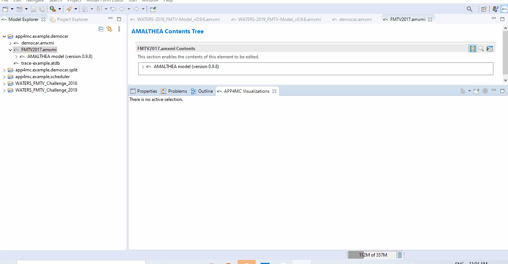

# SimulationGUI
This project was created as a **Google Summer of Code 2020** project for The Eclipse Foundation. It involves creating a graphical user interface and a simulator to visualize the simulation of task scheduling on Eclipse APP4MC.

## Proposal
The aim of this project is to visualize the execution trace of a simulated APP4MC model including its states within APP4MC using a framework such as e.g. Nebula Timeline. Henceforth, the scope lies in implementing (i) a rudimentary simulation engine and (ii) a frontend for visualizing the results. The rudimentary simulation backend should support a simple scheduling algorithm, such as e.g. fully preemptive priority based scheduling.

[This GSoC Project link](https://summerofcode.withgoogle.com/projects/#4648063622184960) provides the details about the Project proposal and scope.

## GSoC Project Details
**Contributor:** Philip Okonkwo ([Twitter](twitter.com/@npkompleet), [LinkedIn](https://www.linkedin.com/in/philip-okonkwo-201aa163/))

**Project Name:** A Simulation-Visualizer For Eclipse APP4MC.

**Organization:** The Eclipse Foundation.

**Mentors:** Lukas Krawczyk, Dirk Fauth.

## Contributions
*   Extending the [Eclipse Nebula timeline widget](https://www.eclipse.org/nebula/widgets/timeline/timeline.php) to include the possibility of adding annotations that indicate arrival time and deadlines of tasks in the timeline view.

*   Creating a user interface for visualization of the simulation.
    
*   Implementing the simulation backend by creating rudimentary schedulers like Earliest Deadline First or Rate Monotonic.

*   Creating a visualization of the simulation of APP4MC models by connecting the model to the simulation back end and rendering the results on the GUI.

*   Testing and documentation.

## Documentation
The documentation and more details for this project is hosted on ReadTheDocs and the link is [here](https://simulationgui.readthedocs.io/en/latest/#).

## Building and Running The Project
To be able to build and use this project, you will need Eclipse APP4MC version 0.9.8.

1.  Download this repository or clone it.

2.  Open Eclipse APP4MC version 0.9.8, create a new workspace and add all the plugin project directories using **File**...**Open Project From File System**.

3. Double click the MANIFEST.MF file in the **META-INF** folder of the `org.eclipse.app4mc.timeline` plugin project. Under the _Overview_ tab, find the _Testing_ section and click on the __Launch an Eclipse Application__ link. A new Eclipse APP4MC instance is started.

4.  In the new APP4MC instance, open any APP4MC model project. A quick way to add a project might be using some of the APP4MC model examples bundled with Eclipse APP4MC, e.g the Democar example, using **File**...**New**...**Examples**...**APP4MC AMALTHEA Model Examples**.

5. Double click the model file and the AMALTHEA Contents Tree window is opened. 

6.  In the AMALTHEA Contents Tree window, right click the AMALTHEA Model and select __Open APP4MC Visualization__ in the popup menu. A visualization panel is opened under the contents tree and you can see the user interface to use to run the simulation and visualization.