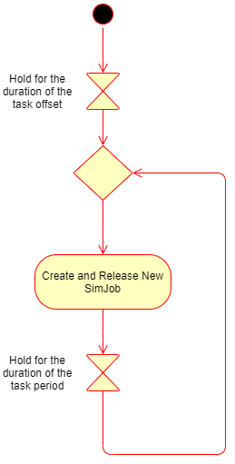

Google Summmer of Code Contribution
===================================

This project was started as a Google Summmer of Code 2020 project.

********************
Software Development 
********************

The sofware development for this project includes:

    -   Extending the Nebula Timeline widget to include the possibility
        of adding annotations that indicate arrival time and deadlines
        of tasks in the timeline view.

    -   Creating the GUI for users to enter simulation parameters.
    
    -   Implementing the simulation backend by creating rudimentary
        schedulers like Earliest Deadline First or Rate Monotonic.

    -   Creating a visualization of the simulation of APP4MC models by
        connecting the model to the simulation back end and rendering
        the results on the GUI.

**************
User Interface
**************

----------------
How It Works
----------------

----------------
Implementation
----------------

**********
Simulation
**********

----------------
Simulating Tasks
----------------

---------------
Simulating Jobs
---------------
.. image:: images/activitydiagram2.png
   :alt: SimJob

----------------
Simulating Cores
----------------

**********
Schedulers
**********
All schedulers used in the project must inherit from the abstract class 
**Scheduler.java** and override its ``getComparator()`` method to implement its 
own specific form of scheduling priority.

-----------------
Scheduler Example
-----------------
Here is a simple example of the EDF Scheduler implemented in the code.

.. code-block:: java
    :linenos:

    public class EDFScheduler extends Scheduler {

        @Override
        public Comparator<SimJob> getComparator() {
            return (a, b) -> a.getAbsoluteDeadline() - b.getAbsoluteDeadline();
        }
    }
