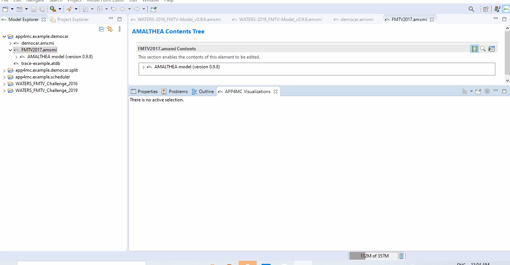

===========================
Introduction To The Project
===========================

***************************
Scope of This Documentation
***************************

This application document is set up to explain how to use and extend the Task Scheduler simulation GUI 
created for `Eclipse APP4MC <https://www.eclipse.org/app4mc/>`_ as a contribution to the Google Summer of Code 2020.

********************
Scope of The Project
********************

The project involved creating a simulation visualization for rudimentary
scheduling algorithms like `EDF <https://en.wikipedia.org/wiki/Earliest_deadline_first_scheduling>`_ 
and `RM <https://en.wikipedia.org/wiki/Rate-monotonic_scheduling>`_. The idea is to be able to select
an APP4MC model in the Eclipse APP4MC IDE and be able to simulate the tasks
running on each core stored in the model using any chosen scheduling
algorithm.

--------------------
Project Dependencies
--------------------

This project was built using the following libraries:

    - `Nebula Timeline widget. <https://www.eclipse.org/nebula/widgets/timeline/timeline.php>`_
    - `DESMO-J <http://desmoj.sourceforge.net/home.html>`_, a Java library for discrete event simulation.

.. note:: The Nebula Timeline Widget does not support annotations 
            so modifications had to be made to it by me to be able to use it to 
            achieve the aims of this project.

