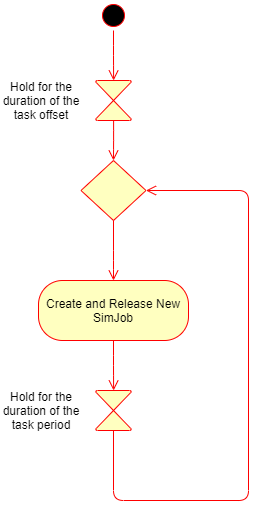
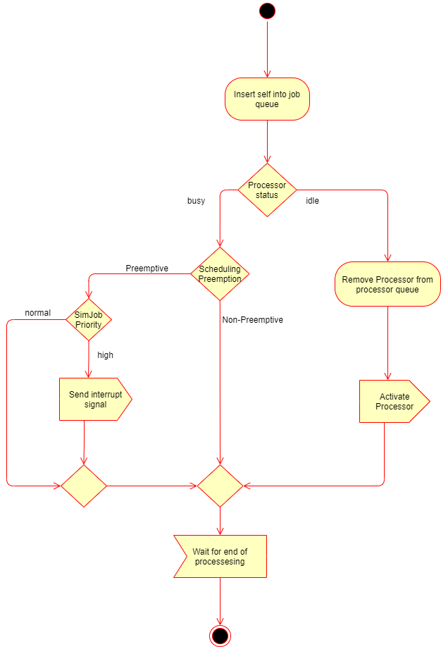
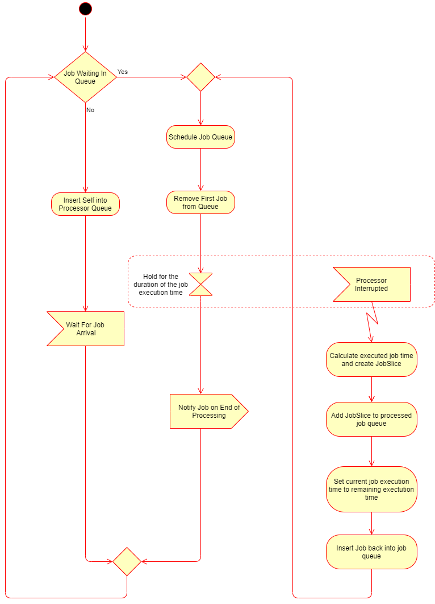

**********
Simulation
**********

The simulation part of this project was achieved using DESMO-J which is a
`discrete event simulation <https://en.wikipedia.org/wiki/Discrete_event_simulation>`_ 
library developed in Java by the University of Hamburg. It was first released in 1999
and it supports both process oriented and event oriented styles of discrete
event simulation. For this project, the process oriented style was best 
suited so that is what is used.

To learn more about discrete event simulation using DESMO-J, you can check 
`this tutorial <http://desmoj.sourceforge.net/tutorial/index.html>`_.

----------------
Simulating Tasks
----------------
Tasks are represented by the ``SimTask`` class. All the task does it to
release a job every period.

   
   SimTask Acivity Diagram

---------------
Simulating Jobs
---------------
Jobs are released by tasks periodically and are represented by the ``SimJob``
class. 

   SimJob Activity Diagram

As soon as a job is released by its parent task, it adds itself to the job queue of a
processor and then checks to see if the processor is busy. If the processor
is busy and the scheduling is preemptive, it checks to see if the job currently running on it has a lower 
priority than the new job. If the priority of the new job is higher, the new
interrupts the processor. Else it stays in the job queue and waits for the 
processor to execute it and be notified of the end of its execution.

----------------
Simulating Cores
----------------
Cores/Processors are represented by the ``Processor`` class. It is on
the core that SimJobs are run and the schedulers are used by the core
to select which task has the priority.

   Processor Activity Diagram

When the processor starts, it checks to see if there is any job in the
job queue. If it finds none it goes dormant (passivates) and waits for
activation by an arriving job.

If the job queue is not empty, the processor schedules the jobs in the
queue using the chosen schedulers and then starts executing the first
scheduled job for the duration of the job's execution time. If the
processor is interrupted, it creats a slice of the current job
and sets the execution time of the current job to the remaining execution
time then puts the job back on the job queue and schedules the jobs in the
job queue again and executes the first scheduled job.

-----------
SimJobSlice
-----------
