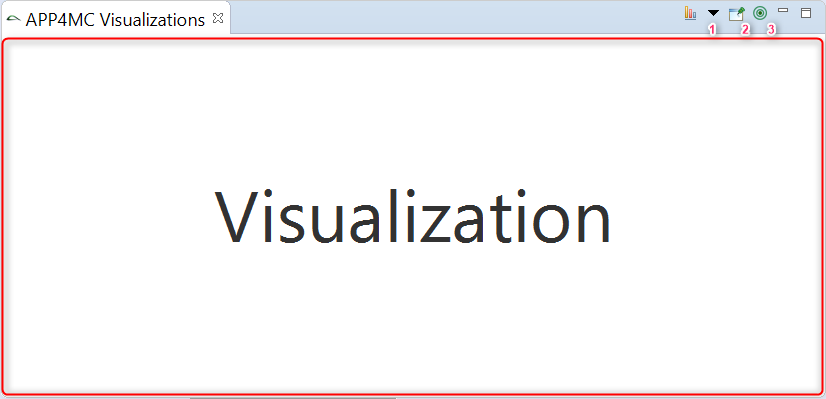
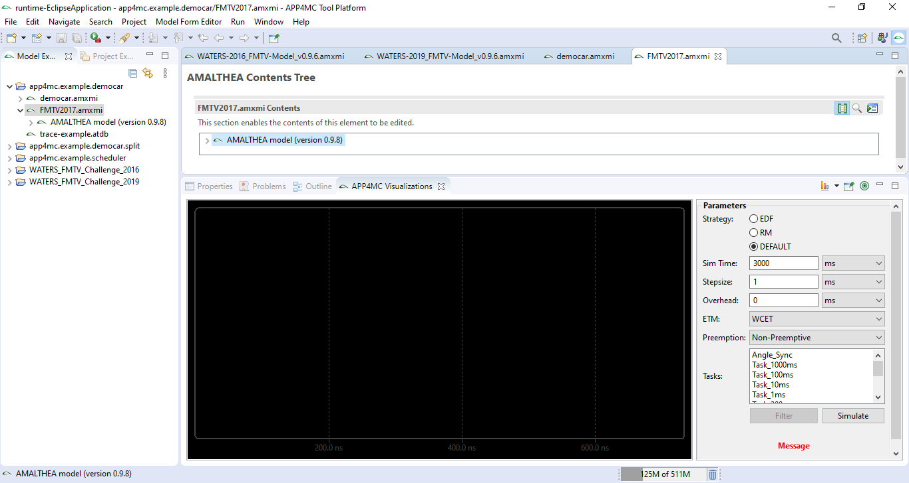
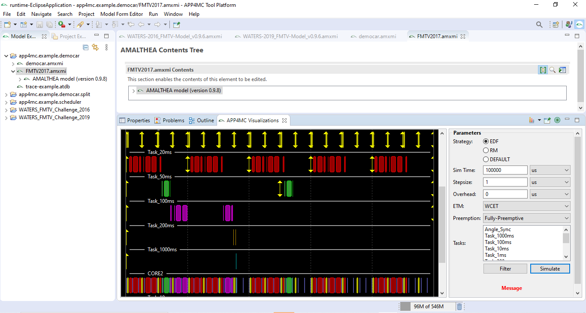

Graphical User Interface
========================

The user interface and controller classes discussed in this section are found under the 
``org.eclipse.app4mc.visualization.timeline.ui`` package in the main project folder.

********************
Software Development 
********************

The software development for this project includes:

    -   Extending the Nebula Timeline widget to include the possibility
        of adding annotations that indicate arrival time and deadlines
        of tasks in the timeline view.

    -   Creating the GUI for users to enter simulation parameters.
    
    -   Implementing the simulation backend by creating rudimentary
        schedulers like Earliest Deadline First or Rate Monotonic.

    -   Creating a visualization of the simulation of APP4MC models by
        connecting the model to the simulation back end and rendering
        the results on the GUI.

The architecture used is similar to the MVC architecture with the user interface
as the view, a contoller and the simulation model itself as the Model.

**************
User Interface
**************
The user interface is built on the visualization framework for Eclipse
APP4MC. It uses SWT and Jface for the UI components
and it also uses OSGi Declarative Services.

----------------
How It Works
----------------
The plug-in ``org.eclipse.app4mc.visualization.ui`` [1]_ provides a small framework 
to visualize model elements. It contains a view part ``VisualizationPart`` that 
can be opened via `Window – Show View – Other… – APP4MC – APP4MC Visualizations`, 
or via right click on an element and selecting `Open APP4MC Visualization`. 
Via the context menu it is also possible to open multiple instances of the 
VisualizationPart.

On selecting a model element, the ``VisualizationPart`` is updated to render a 
corresponding visualization. The visualization to render is searched in the 
``ModelVisualizationRegistry`` OSGi service. If multiple visualizations are 
registered, the first one will be selected by default, unless the user has 
selected another visualization before.

The visualization view has 3 buttons in the toolbar:

    1.  **Visualization dropdown** - The dropdown contains all available 
        visualizations for the current active selection. A click on the image 
        will reload the visualization.

    2.  **Pin visualization** - The selection handling will be disabled so the 
        visualization gets not updated on model selection changes.

    3.  **Select model element** - Selects the current visualized model element 
        in the model editor. Useful for example if a visualization is pinned and 
        the selection in the model editor changed.

The whole area within the red box in the picture above is what is 
used to render the visualization in Eclipse APP4MC.

.. note:: To learn more about the Visualization framework in Eclipse APP4MC read
            **Model Visualization** sections under the **User Guide** and the 
            **Developer Guide** of the Eclipse APP4MC Documentation.

----------------
Implementation
----------------
The user interface is reprensented by the ``SimView`` class and was built using SWT, Jface and the Eclipse Nebula timeline
widget. When the model is clicked, the user interface is displayed and populated
with the hyperperiod of all the periodic tasks in the model by the :ref:`TheController`.

The user interface has inputs for entering the simulation time, the step size of
simulation, and the over head of the scheduler used as well as their corresponding
time units. It also has inputs for the execution time model and the preemption style
used in the simulation and buttons for starting the simulation as well as for filtering
the visualization of the simulation.

   The User Interface before simulation.

After the simulation is done, the result is displayed using the Nebula timeline widget 
and showing the arrival time and deadline of each job of each task as well as how the 
task was executed on the processor. Each task is reprensented a lane in the timeline
widget. Each processor is also reprensented by its own lane and all the jobs executed
on it are shown in sequence.

   The User Interface after simulation.

--------------------
Creating Annotations
--------------------
Annotations were created to indicate arrival time and deadlines of
tasks in the visualization. An up-pointing arrow and a down-pointing
arrow are used to represent arrival and deadline respectively.

.. image:: images/tmarrows.png
   :alt: arrows
   :align: center

Each annotation is designed to be constrained to one lane and to
extend and contract along with the height of the lane.

To create a new annotation, the ``AnnotationFigure`` class of the Timeline widget should
be extended. The class has been created specifically for that
purpose. Only on rare occasions should one extend the ``IAnnotationFigure``
interface directly.

.. _TheController:

--------------
Controller
--------------
The controller is represented by the ``Controller`` class. It is responsible for 
communication between the user interface and the simulation. It takes the UI 
parameters and puts them in a form compatible with the simulation then starts
the simulation when the **Simulate** button is clicked on the UI.

After the simuation is done, it sends the list of processors as well as the processed 
jobs to the user interface to be displayed.

.. [1] The need for this has been briefly highted in the :ref:`Dependencies` section.

