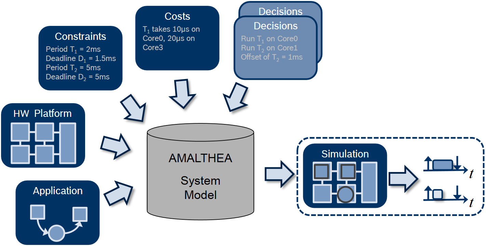

=======================
What is Eclipse APP4MC?
=======================

**Eclipse APP4MC** is a platform for engineering embedded multi- and many-core software systems. 
The platform enables the creation and management of complex tool chains including simulation and validation. 
As an open platform, proven in the automotive sector by Bosch and their partners, it supports interoperability 
and extensibility and unifies data exchange in cross-organizational projects. [1]_

.. [1] Eclipse APP4MC homepage: https://www.eclipse.org/app4mc/.